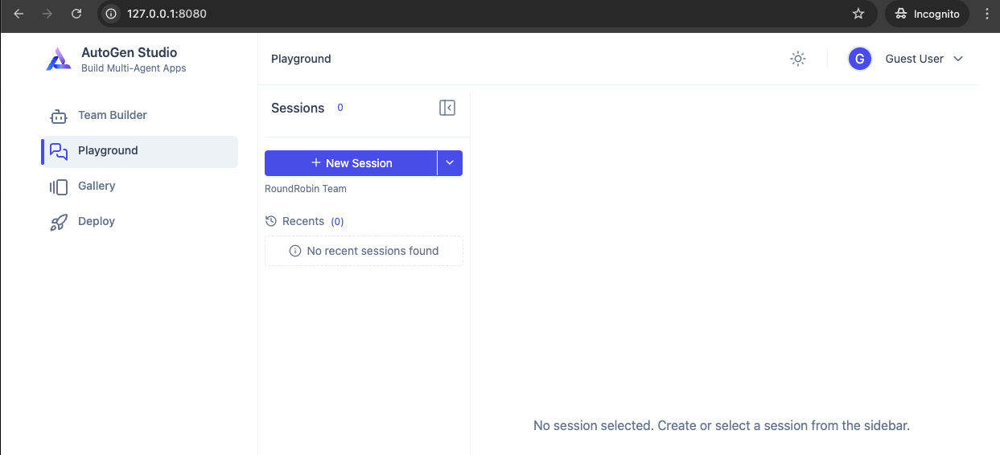
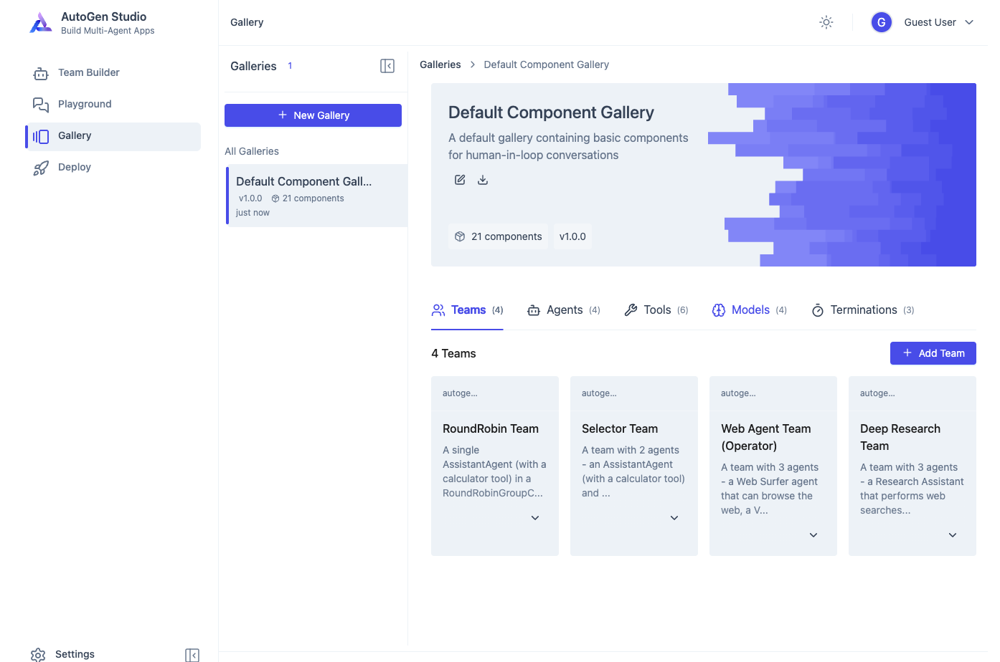
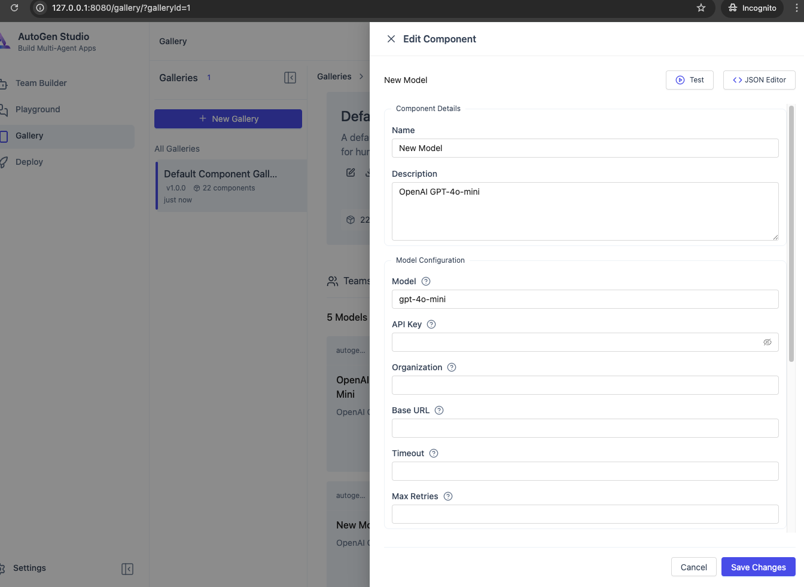
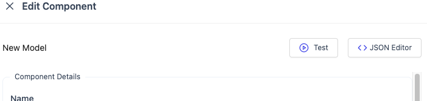

# Using Microsoft Autogen Studio with Local LLMs

This tutorial guides you through creating agents and teams with Microsoft Autogen Studio using local Large Language Models (LLMs).

## Prerequisites

- Python 3.8 or higher
- Microsoft Autogen Studio installed
- Local LLM. Qwen is used in this example. If you're using Qwen3, you can use the [qwen3-autogen-client](https://pypi.org/project/qwen3-autogen-client/) package.

## Setting Up Autogen Studio

1. Install Autogen Studio:
    ```bash
    pip install -r requirements.txt
    # This will install Autogen Studio UI, core libraries, and the Qwen3 client  ```

2. Launch Autogen Studio:
    ```bash
    autogenstudio ui --port 8080 --appdir ./test-agents
    ```

    3. You should see the following output:
        ```
        2025-06-17 19:51:58.644 | INFO     | autogenstudio.web.initialization:__init__:39 - Initializing application data folder: test-agents 
        2025-06-17 19:51:58.644 | INFO     | autogenstudio.web.auth.manager:__init__:26 - Initialized auth manager with provider: none
        INFO:     Started server process [50582]
        INFO:     Waiting for application startup.
        2025-06-17 19:51:58.673 | INFO     | autogenstudio.database.db_manager:initialize_database:82 - Creating database tables...
        2025-06-17 19:51:58.734 | INFO     | autogenstudio.database.schema_manager:_initialize_alembic:133 - Alembic initialization complete
        INFO  [alembic.runtime.migration] Context impl SQLiteImpl.
        INFO  [alembic.runtime.migration] Will assume non-transactional DDL.
        2025-06-17 19:51:58.766 | INFO     | autogenstudio.web.app:lifespan:39 - Application startup complete. Navigate to http://127.0.0.1:8080
        ```

    4. Open your browser and navigate to `http://127.0.0.1:8080` to access Autogen Studio




    5. Select Gallery 

    

    6. Models -> Add Model
    

    7. Switch to JSON Editor 

    8. Add the following details, in place of default OpenAI values: 

    ```json
    {
        "name": "assistant_agent",
        "model_client": {
            "provider": "qwen3_autogen_client.QwenOpenAIChatCompletionClient",
            "component_type": "model",
            "version": 1,
            "component_version": 1,
            "description": "Qwen3-4B local",
            "label": "Qwen3-4B",
            "config": {
                "model": "Qwen3-4B",
                "api_key": "None",
                "base_url": "http://localhost:8090/v1"
            }
        }
    }
    ```

    


## Connecting Local LLMs

### Step 1: Configure LLM Endpoint

1. In Autogen Studio, navigate to the "Settings" page
2. Select "Add New Model"
3. Choose "Local LLM" as the model type
4. Configure your model parameters:
    - Model path or endpoint
    - Context window
    - Temperature
    - Other model-specific parameters

### Step 2: Test Your LLM Connection

1. Go to the "Playground" section
2. Select your configured local LLM
3. Send a test message to verify the connection

## Creating Agents

### Step 1: Define Agent Properties

1. Go to the "Agents" section
2. Click "Create New Agent"
3. Configure your agent:
    - Name
    - Description
    - Model (select your local LLM)
    - System prompt
    - Function calling capabilities

### Step 2: Customize Agent Behavior

1. Define the agent's persona
2. Set up knowledge base connections
3. Configure any tools or APIs the agent can access

## Building Agent Teams

### Step 1: Create a Team

1. Navigate to the "Teams" section
2. Click "Create New Team"
3. Add a name and description

### Step 2: Add Agents to Team

1. Select agents from your created list
2. Define agent roles within the team
3. Set up the communication flow between agents

### Step 3: Configure Team Workflow

1. Define the team's objectives
2. Set up the conversation flow
3. Configure how agents collaborate to solve tasks

## Testing and Optimization

1. Use the "Workflows" section to create test scenarios
2. Run your agent team on sample tasks
3. Analyze performance and refine agent prompts and team dynamics

## Advanced Techniques

- Implement memory across conversations
- Create specialized agents for different tasks
- Design complex workflows with conditional branching

## Troubleshooting

- Check model compatibility with Autogen
- Monitor resource usage for large local models
- Optimize context length for better performance